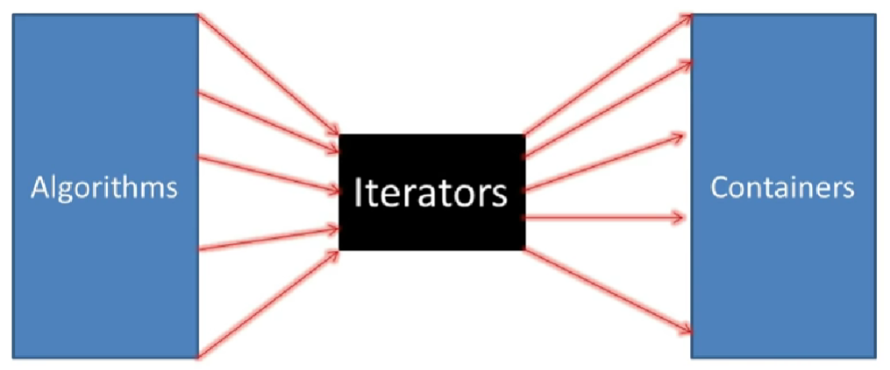
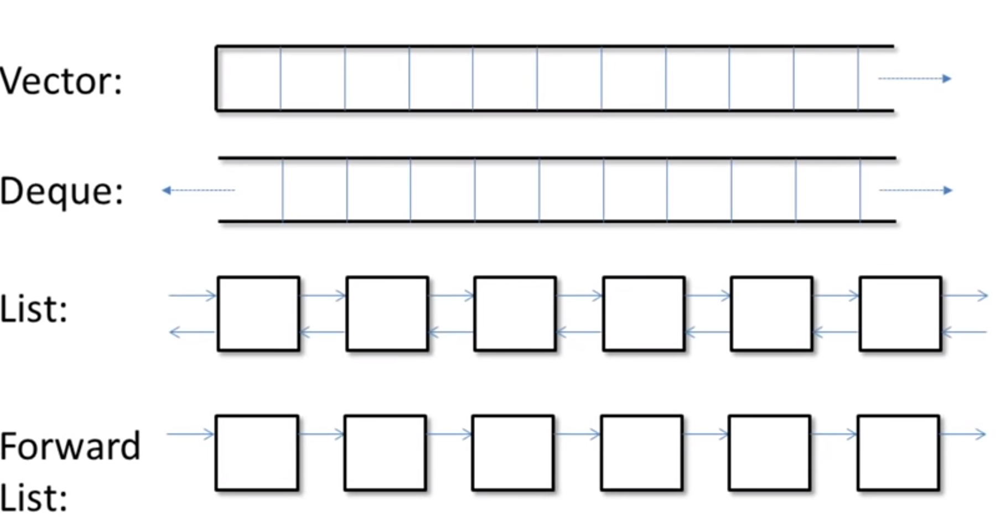
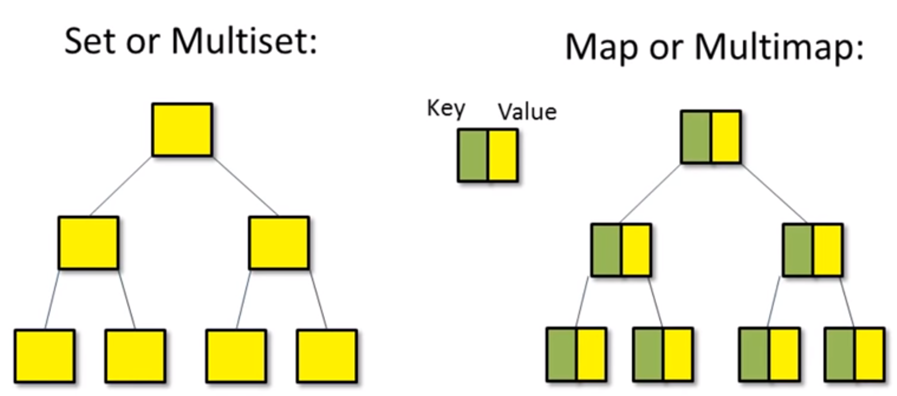
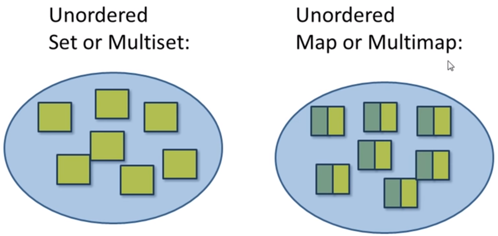

### STL contains  
- Algorithms & Functions
- Containers
- Iterators



### STL Headers
```c++
#include <vector>
#include <deque>
#include <list>
#include <set>   // set and multiset
#include <map>   // map and multimap
#include <unordered_set>  // unordered set/multiset
#include <unordered_map>  // unordered map/multimap
#include <iterator>
#include <algorithm>
#include <numeric>    // some numeric algorithm
#include <functional>
```
---

Why use STL ?
- Code reuse (no need to reinvent the wheel)
- Efficiency (fast and use less resources) & modern C++ compilers are tuned to optimize C++ standard library code
- Accurate, less buggy
- Readable code, reduced control flow
- Standardization, guarenteed availability

---

### Types of Containers

**1. Sequence Containers**
- array & linked list based
- vector, deque, list, forward_list, array



**2. Associative Containers**
- binary tree based, stored in sorted order
- set, multiset, map, multimap



**3. Unordered Containers**
- hash table based
- unordered set/ multiset, unordered map/ multimap



---